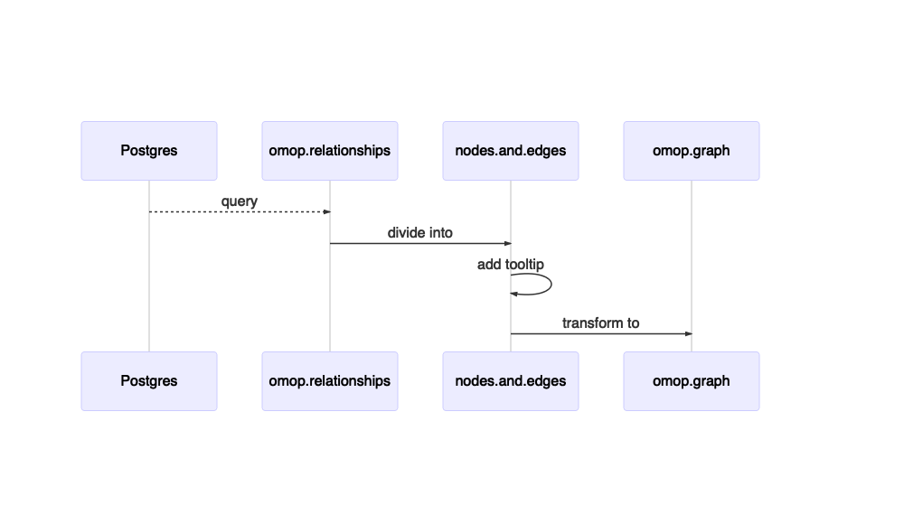

<!-- README.md is generated from README.Rmd. Please edit that file -->

# chariotViz

Visualize the OMOP vocabularies from multiple dimensions using the
DiagrammeR package.

## Installation

You can install the development version from
[GitHub](https://github.com/) with:

``` r
# install.packages("devtools")
devtools::install_github("meerapatelmd/chariotViz")
```

## Prerequisites

-   OMOP vocabularies loaded into a Postgres instance (see
    [setupAthena](http://github.com/meerapatelmd/setupAthena)).  
-   R.cache R package that caches the query resultsets.

# How It Works

## S4 Classes


The raw OMOP data is fetched from the Postgres instance.

``` r
library(chariotViz)

omop_rels <- 
  fetch_omop_relationships(version_key = get_version_key())
```

The fetched data belongs to the `omop.relationships` S4 class.

``` r
class(omop_rels)
#> [1] "omop.relationships"
#> attr(,"package")
#> [1] "chariotViz"
```

The `omop.relationship` class is converted to the `nodes.and.edges` S4
class.

``` r
omop_ne <- 
  create_nodes_and_edges(omop_relationships = omop_rels)

class(omop_ne)
#> [1] "nodes.and.edges"
#> attr(,"package")
#> [1] "chariotViz"
```

From `nodes.and.edges`, an `omop.graph` S4 class object can be
constructed.

``` r
omop_gr <- 
  construct_graph(omop_ne)
#> Warning: Unknown or uninitialised column: `id`.

class(omop_gr)
#> [1] "omop.graph"
#> attr(,"package")
#> [1] "chariotViz"
```

The `omop.graph` can then be rendered, but due to its size, `force` must
be set to TRUE in order to do so.

``` r
chariotViz(omop_gr)
#>                              ─────────────────────
#>                                n nodes   n edges  
#>                              ─────────────────────
#>                                    650      9030  
#>                              ─────────────────────
#> There are 650 nodes and 9030 edges.
#> To render anyways, set `force` to TRUE.
```

## Subsetting

An `omop.relationships` object can be subset using tidyverse-style
filtering. Here, I am subsetting for all the relationships associated
with Cancer Modifier. Since the node count is below the threshold set by
default in the `chariotViz` function, the graph renders automatically
and without having to set `force` to TRUE.

``` r
cancer_modifier_relationships <- 
  omop_rels %>% 
    filter_omop_relationships(
      vocabulary_id_1 == "Cancer Modifier")

cancer_modifier_ne <- 
  cancer_modifier_relationships %>% 
  create_nodes_and_edges()

cancer_modifier_graph <- 
  cancer_modifier_ne %>% 
  construct_graph()
#> Warning: Unknown or uninitialised column: `id`.

chariotViz(cancer_modifier_graph)
#>                              ─────────────────────
#>                                n nodes   n edges  
#>                              ─────────────────────
#>                                     15        14  
#>                              ─────────────────────
```


## Adding Pizzaz

The visualization is nice, but it needs a little oomph. A tooltip and
visualization attributes can be added to the `nodes.and.edges` class
object prior to graph construction. (Note that the tooltip is not
rendering in this README, but view articles to see examples.)



``` r
cancer_modifier_relationships <- 
  omop_rels %>% 
    filter_omop_relationships(
      vocabulary_id_1 == "Cancer Modifier")

cancer_modifier_ne <- 
  cancer_modifier_relationships %>% 
  create_nodes_and_edges() %>% 
  add_tooltip()

cancer_modifier_graph <- 
  cancer_modifier_ne %>% 
  construct_graph()
#> Warning: Unknown or uninitialised column: `id`.

chariotViz(cancer_modifier_graph)
#>                              ─────────────────────
#>                                n nodes   n edges  
#>                              ─────────────────────
#>                                     15        14  
#>                              ─────────────────────
```


In addition to the tooltip, the way the nodes and edges appear can also
be customized.


``` r
cancer_modifier_relationships <- 
  omop_rels %>% 
    filter_omop_relationships(
      vocabulary_id_1 == "Cancer Modifier")

cancer_modifier_ne <- 
  cancer_modifier_relationships %>% 
  create_nodes_and_edges() %>% 
  add_tooltip() %>% 
  map_node_attributes() %>% 
  map_edge_attributes()
#> ══ 
#> Node Attributes ════════════════════════════════════════
#> ℹ Shape from: standard_concept
#> ✓ All 2 unique values mapped:
#>                             ───────────────────────
#>                               Attribute   Value    
#>                             ───────────────────────
#>                               S           circle   
#>                               NA          circle   
#>                             ───────────────────────
#> ℹ Style from: standard_concept
#> ✓ All 2 unique values mapped:
#>                             ───────────────────────
#>                               Attribute   Value    
#>                             ───────────────────────
#>                               S           filled   
#>                               NA          filled   
#>                             ───────────────────────
#> ℹ Color from: standard_concept
#> ✓ All 2 unique values mapped:
#>                             ───────────────────────
#>                               Attribute   Value    
#>                             ───────────────────────
#>                               S           black    
#>                               NA          white    
#>                             ───────────────────────
#> ℹ Fillcolor from: vocabulary_id
#> ! 3 values not mapped: CIM10, KCD7, and Read. Mapping to `other` value 'gray20'.
#> ℹ Fontcolor from: standard_concept
#> ✓ All 2 unique values mapped:
#>                             ───────────────────────
#>                               Attribute   Value    
#>                             ───────────────────────
#>                               S           black    
#>                               NA          gray40   
#>                             ───────────────────────
#> ℹ 3 constant attributes added: fontsize, width, and height.
#> ✓ All 1 unique value mapped:
#>                             ───────────────────────
#>                               Attribute   Value    
#>                             ───────────────────────
#>                               0           solid    
#>                             ───────────────────────
#> ✓ All 1 unique value mapped:
#>                             ───────────────────────
#>                               Attribute   Value    
#>                             ───────────────────────
#>                               OMOP        black    
#>                             ───────────────────────
#> ✓ All 1 unique value mapped:
#>                             ───────────────────────
#>                               Attribute   Value    
#>                             ───────────────────────
#>                               0           2        
#>                             ───────────────────────
#> ✓ All 1 unique value mapped:
#>                             ───────────────────────
#>                               Attribute   Value    
#>                             ───────────────────────
#>                               0           vee      
#>                             ───────────────────────
#> ℹ 2 constant attributes added: fontsize and len.

cancer_modifier_graph <- 
  cancer_modifier_ne %>% 
  construct_graph()
#> Warning: Unknown or uninitialised column: `id`.

chariotViz(cancer_modifier_graph)
#>                              ─────────────────────
#>                                n nodes   n edges  
#>                              ─────────────────────
#>                                     15        14  
#>                              ─────────────────────
```


## Resizing

Due to the large number of other relationships for Cancer Modifier, the
height needs to be increased to make it more legible.

``` r
chariotViz(cancer_modifier_graph,
           height = 1500,
           width = 500)
#>                              ─────────────────────
#>                                n nodes   n edges  
#>                              ─────────────────────
#>                                     15        14  
#>                              ─────────────────────
```


## Reconfiguring

The direction can also be reconfigured.

``` r
cancer_modifier_relationships <- 
  omop_rels %>% 
    filter_omop_relationships(
      vocabulary_id_1 == "Cancer Modifier")

cancer_modifier_ne <- 
  cancer_modifier_relationships %>% 
  create_nodes_and_edges() %>% 
  add_tooltip() %>% 
  map_node_attributes() %>% 
  map_edge_attributes()
#> ══ 
#> Node Attributes ════════════════════════════════════════
#> ℹ Shape from: standard_concept
#> ✓ All 2 unique values mapped:
#>                             ───────────────────────
#>                               Attribute   Value    
#>                             ───────────────────────
#>                               S           circle   
#>                               NA          circle   
#>                             ───────────────────────
#> ℹ Style from: standard_concept
#> ✓ All 2 unique values mapped:
#>                             ───────────────────────
#>                               Attribute   Value    
#>                             ───────────────────────
#>                               S           filled   
#>                               NA          filled   
#>                             ───────────────────────
#> ℹ Color from: standard_concept
#> ✓ All 2 unique values mapped:
#>                             ───────────────────────
#>                               Attribute   Value    
#>                             ───────────────────────
#>                               S           black    
#>                               NA          white    
#>                             ───────────────────────
#> ℹ Fillcolor from: vocabulary_id
#> ! 3 values not mapped: CIM10, KCD7, and Read. Mapping to `other` value 'gray20'.
#> ℹ Fontcolor from: standard_concept
#> ✓ All 2 unique values mapped:
#>                             ───────────────────────
#>                               Attribute   Value    
#>                             ───────────────────────
#>                               S           black    
#>                               NA          gray40   
#>                             ───────────────────────
#> ℹ 3 constant attributes added: fontsize, width, and height.
#> ✓ All 1 unique value mapped:
#>                             ───────────────────────
#>                               Attribute   Value    
#>                             ───────────────────────
#>                               0           solid    
#>                             ───────────────────────
#> ✓ All 1 unique value mapped:
#>                             ───────────────────────
#>                               Attribute   Value    
#>                             ───────────────────────
#>                               OMOP        black    
#>                             ───────────────────────
#> ✓ All 1 unique value mapped:
#>                             ───────────────────────
#>                               Attribute   Value    
#>                             ───────────────────────
#>                               0           2        
#>                             ───────────────────────
#> ✓ All 1 unique value mapped:
#>                             ───────────────────────
#>                               Attribute   Value    
#>                             ───────────────────────
#>                               0           vee      
#>                             ───────────────────────
#> ℹ 2 constant attributes added: fontsize and len.

cancer_modifier_graph <- 
  cancer_modifier_ne %>% 
  construct_graph(attr_theme = "tb")
#> Warning: Unknown or uninitialised column: `id`.

chariotViz(cancer_modifier_graph,
           width = 2500,
           height = 500)
#>                              ─────────────────────
#>                                n nodes   n edges  
#>                              ─────────────────────
#>                                     15        14  
#>                              ─────────────────────
```


## Adding Example Concepts

``` r
set.seed(seed = 1)
cancer_modifier_relationships <- 
  omop_rels %>% 
    filter_omop_relationships(
      vocabulary_id_1 == "Cancer Modifier")

cancer_modifier_ne <- 
  cancer_modifier_relationships %>% 
  create_nodes_and_edges() %>% 
  add_tooltip() %>% 
  map_node_attributes() %>% 
  map_edge_attributes()
#> ══ 
#> Node Attributes ════════════════════════════════════════
#> ℹ Shape from: standard_concept
#> ✓ All 2 unique values mapped:
#>                             ───────────────────────
#>                               Attribute   Value    
#>                             ───────────────────────
#>                               S           circle   
#>                               NA          circle   
#>                             ───────────────────────
#> ℹ Style from: standard_concept
#> ✓ All 2 unique values mapped:
#>                             ───────────────────────
#>                               Attribute   Value    
#>                             ───────────────────────
#>                               S           filled   
#>                               NA          filled   
#>                             ───────────────────────
#> ℹ Color from: standard_concept
#> ✓ All 2 unique values mapped:
#>                             ───────────────────────
#>                               Attribute   Value    
#>                             ───────────────────────
#>                               S           black    
#>                               NA          white    
#>                             ───────────────────────
#> ℹ Fillcolor from: vocabulary_id
#> ! 3 values not mapped: CIM10, KCD7, and Read. Mapping to `other` value 'gray20'.
#> ℹ Fontcolor from: standard_concept
#> ✓ All 2 unique values mapped:
#>                             ───────────────────────
#>                               Attribute   Value    
#>                             ───────────────────────
#>                               S           black    
#>                               NA          gray40   
#>                             ───────────────────────
#> ℹ 3 constant attributes added: fontsize, width, and height.
#> ✓ All 1 unique value mapped:
#>                             ───────────────────────
#>                               Attribute   Value    
#>                             ───────────────────────
#>                               0           solid    
#>                             ───────────────────────
#> ✓ All 1 unique value mapped:
#>                             ───────────────────────
#>                               Attribute   Value    
#>                             ───────────────────────
#>                               OMOP        black    
#>                             ───────────────────────
#> ✓ All 1 unique value mapped:
#>                             ───────────────────────
#>                               Attribute   Value    
#>                             ───────────────────────
#>                               0           2        
#>                             ───────────────────────
#> ✓ All 1 unique value mapped:
#>                             ───────────────────────
#>                               Attribute   Value    
#>                             ───────────────────────
#>                               0           vee      
#>                             ───────────────────────
#> ℹ 2 constant attributes added: fontsize and len.

cancer_modifier_graph <- 
  cancer_modifier_ne %>% 
  construct_graph() %>% 
  append_concept_examples(sample_size = 3)
#> Warning: Unknown or uninitialised column: `id`.

#> Warning: Unknown or uninitialised column: `id`.

#> Warning: Unknown or uninitialised column: `id`.

chariotViz(cancer_modifier_graph)
#>                              ─────────────────────
#>                                n nodes   n edges  
#>                              ─────────────────────
#>                                     60        59  
#>                              ─────────────────────
#> There are 60 nodes and 59 edges.
#> To render anyways, set `force` to TRUE.

chariotViz(cancer_modifier_graph,
           force = TRUE,
           height = 2500,
           width = 700)
#>                              ─────────────────────
#>                                n nodes   n edges  
#>                              ─────────────────────
#>                                     60        59  
#>                              ─────────────────────
```


